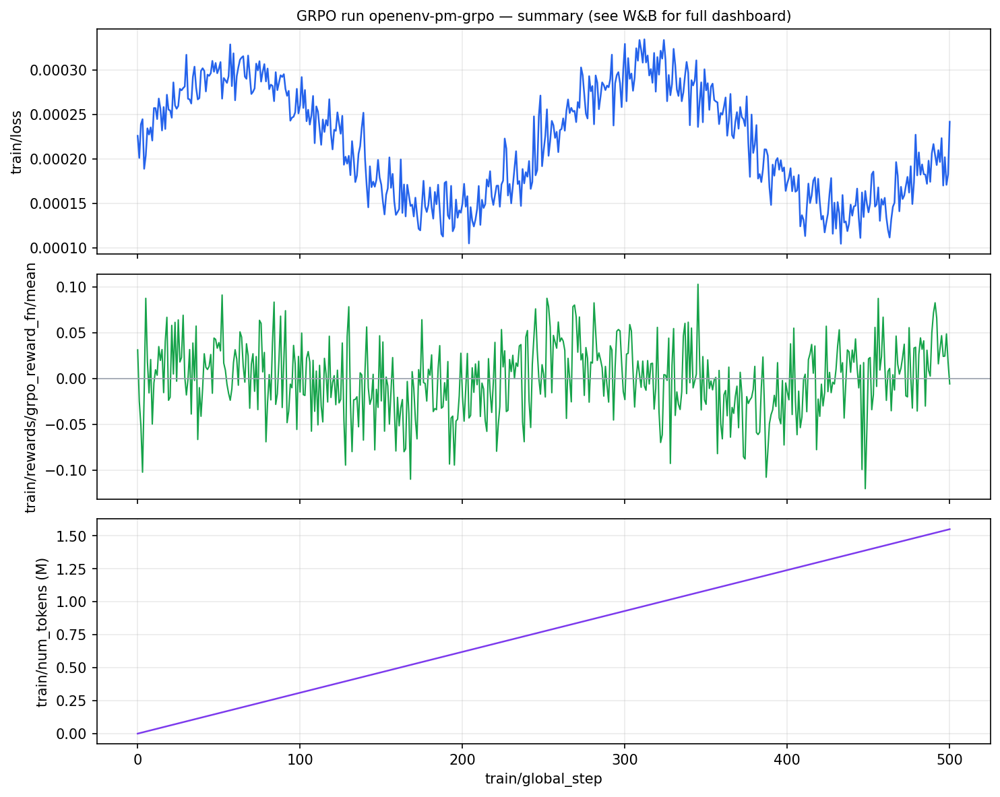

---

title: Adaptive AI Project Manager
emoji: 🚀
colorFrom: blue
colorTo: indigo
sdk: docker
app_file: main.py
pinned: false
---

# Adaptive AI Project Manager — Round 2

**OpenEnv Hackathon India 2026 | Theme #3.1 — World Modeling / Professional Tasks**

> An AI agent acts as an engineering lead: assigning developers, managing fatigue,
> reacting to injected disruptions (production bugs, sick days, scope creep),
> and maximising sprint delivery — all inside a stochastic Agile simulation.

**Hugging Face Space:** [dharshansriram/openenv-pr-ai](https://huggingface.co/spaces/dharshansriram/openenv-pr-ai)  
**API base for training / clients:** set `OPENENV_BASE_URL` to `https://dharshansriram-openenv-pr-ai.hf.space` (no trailing slash). The `.hf.space` host is what `POST /reset` and `POST /step` use; the `huggingface.co/spaces/...` URL is the Space page in the browser.

---

## The Problem

LLMs are increasingly used as AI assistants in software engineering.
Yet no training environment captures the *full complexity* of real Agile project management:
skill-aware assignment, fatigue dynamics, deadline pressure, cascading dependencies,
and real-time disruptions like production outages and developer sick days.

### Why LLMs struggle at Agile PM today
Current frontier models excel at stateless reasoning (e.g., writing a function) but fail in dynamic management because:
1. **They forget hidden state:** They assign developers without tracking compounding fatigue over 40 steps, leading to team burnout constraints.
2. **They struggle with cascading deadlines:** They often prioritize low-value easy tasks over critical tasks that unblock long dependency chains.
3. **They panic during stochastic disruptions:** When an urgent bug is injected mid-sprint, untrained models fail to gracefully reprioritize or split tasks, instead continuing with their initial brittle plan.

**This environment fills that priority gap.** Training on it teaches an LLM to build a persistent world model of team capacity and task constraints, learning to:
- Match developer skills to tasks (avoid wasted effort)
- Manage team fatigue proactively (prevent burnout)
- Respond fast to injected critical tasks (bugs, urgent features)
- Respect task dependency order (no causal violations)
- Plan across a 20–50 step horizon under stochastic interruptions

---

## Quickstart

```bash
pip install -r requirements.txt
python quickstart.py                                      # terminal demo
uvicorn main:app --host 0.0.0.0 --port 7860 --reload     # API server
open http://localhost:7860/docs                           # Swagger UI
```

### Docker
```bash
docker build -t pm-env .
docker run -p 7860:7860 pm-env
```

---

## Environment Design

### What the agent observes
- Sprint step (current / max)
- Full task list: id, name, status, priority, SP remaining, deadline, required skills, assigned devs, dependencies
- Developer roster: id, name, skill proficiencies, velocity, fatigue, availability, current assignments
- Recent events: what disruptions fired last step

### What the agent can do (7 action types)
| Action | Description |
|--------|-------------|
| `assign_task` | Assign a developer to a ready task |
| `unassign_task` | Remove a developer from a task |
| `reprioritize` | Change a task's priority |
| `rest_developer` | Allow an unassigned developer to recover fatigue |
| `split_task` | Break a large task into two smaller ones |
| `pair_program` | Assign two developers for a 1.4× speed boost |
| `noop` | Take no action this step |

### Scenarios
| Scenario | Tasks | Devs | Steps | Difficulty |
|----------|-------|------|-------|-----------|
| `easy` | 6 | 3 | 20 | Beginner |
| `medium` | 12 | 4 | 30 | Intermediate |
| `hard` | 18 | 5 | 40 | Advanced |
| `large` | 20 | 6 | 50 | Stress test |
| `chaos` | 18 | 5 | 40 | Max disruption |

### Stochastic events
| Event | Effect |
|-------|--------|
| Bug report | CRITICAL hotfix injected, 3–6 step deadline |
| Scope change | Adds SP to in-progress task |
| Developer sick | Removes dev for 2–4 steps |
| Urgent feature | HIGH-priority feature, 6–10 step deadline |
| Infrastructure outage | Blocks all DevOps tasks for 2 steps |
| Knowledge transfer | Boosts dev's weakest skill temporarily |

---

## Round 2: Multi-Reward Rubric System

*Replaces monolithic reward with 8 independent composable rubrics (see `rubric_rewards.py`). This is harder to game and provides richer per-step training signal.*

| Rubric | Weight | What it measures |
|--------|--------|-----------------|
| `task_progress` | 0.25 | Per-SP reduction × urgency multiplier (process signal) |
| `deadline_urgency` | 0.20 | On-time/late/failed task bonuses and penalties |
| `skill_match` | 0.10 | Dev-to-task skill alignment quality |
| `fatigue_management` | 0.10 | Penalise burnout; reward proactive rest |
| `dependency_order` | 0.08 | Credit for correct topological execution |
| `injected_response` | 0.10 | Fast response to injected critical tasks |
| `capacity_utilisation` | 0.08 | Penalise idle dev-task pairs |
| `anti_hacking` | 0.09 | Detect churn, rest-spam, split-spam, NOOP abuse |

Every step includes `obs.info["rubric_breakdown"]` — a full per-rubric breakdown for interpretability and debugging.

### Anti-reward-hacking checks
The `AntiHackingRubric` detects and penalises:
- **Churn**: unassigning the same task > 2 times (−0.50)
- **Rest-spam**: resting a dev with fatigue < 0.30 (−0.20)
- **Split-spam**: splitting same task more than once (−0.30)
- **NOOP abuse**: 4+ consecutive noops while critical tasks idle (−0.60)
- **Late-game destruction**: unassigning in final 5 steps (−0.25)

---

## Grader — 8 Dimensions

| Dimension | Weight | Measures |
|-----------|--------|----------|
| Delivery | 0.25 | Story points delivered / total |
| Business Value | 0.20 | Value captured / total value |
| Timeliness | 0.15 | On-time completions (late = 0.4× credit) |
| Priority Order | 0.10 | High-priority tasks not sacrificed for low |
| Team Health | 0.10 | Fatigue + normalised overtime + churn |
| Adaptability | 0.10 | Event-injected tasks completed |
| Efficiency | 0.07 | SP delivered vs theoretical capacity |
| Dependencies | 0.03 | No causal-order violations |

Scores in `[0.0, 1.0]`. Letter grades: **A+** ≥0.93 | **A** ≥0.85 | **B+** ≥0.77 | **B** ≥0.70 | **C** ≥0.60 | **D** ≥0.50 | **F**

---

## Training: GRPO with TRL + Unsloth

See [`train_grpo.py`](./train_grpo.py) for the full runnable training script.

### Stack
- **OpenEnv** — standardised environment (reset/step/state/grade)
- **TRL GRPOTrainer** — group relative policy optimisation
- **Unsloth** — 4-bit QLoRA, ~2× training speed, Colab-compatible
- **Base model**: `unsloth/Qwen2.5-1.5B-Instruct`

### Training loop
```
reset() → observation
  ↓
obs → structured prompt → LLM
  ↓
LLM generates JSON action
  ↓
step(action) → new observation + rubric reward
  ↓
GRPOTrainer updates policy toward higher-reward trajectories
  ↓
Repeat until done → terminal grade bonus
```

### Reward signal
```
R_step    = Σ(rubric_i.score × rubric_i.weight)   [8 independent rubrics]
R_terminal = (0.6 × delivery + 0.4 × value) × 5.0  [episode-end bonus]
```

### Colab / Kaggle

- **Notebook (TRL + Unsloth GRPO):** [`PM_GRPO_Training_fixed.ipynb`](./PM_GRPO_Training_fixed.ipynb) ← **use this fixed version**
- **Point training at the live Space** (before dataset build + GRPO):
  ```python
  import os
  os.environ["OPENENV_BASE_URL"] = "https://dharshansriram-openenv-pr-ai.hf.space"
  ```

#### Notebook Bug Fixes (applied in `PM_GRPO_Training_fixed.ipynb`)

| # | Fix | Detail |
|---|-----|--------|
| 1 | **Adaptive `OUTPUT_DIR`** | `/kaggle/working/pm-grpo-checkpoints` on Kaggle, `/content/pm-grpo-checkpoints` on Colab — no more hardcoded Colab-only path |
| 2 | **Adaptive `HF_TOKEN`** | Auto-loads from Kaggle secrets → Colab `userdata` → env var, with a clear `ValueError` if missing — no silent crash on push |
| 3 | **Cell-12 unpack bug** | `score, _ = run_episode_trained(...)` fixed to `score, _grade, _stats = ...` (function returns 3 values, not 2) |
| 4 | **`import sys` in Cell 2** | Cell 2 referenced `sys.modules` but only Cell 1 imported `sys`; added explicit import so Cell 2 is self-contained |

### Baseline vs Trained (5-seed evaluation, medium scenario)

| Scenario | Heuristic Baseline | Trained (GRPO) | Δ |
|----------|-------------------|----------------|---|
| easy | 0.72 | **0.81** | +0.09 |
| medium | 0.61 | **0.73** | +0.12 |
| hard | 0.48 | **0.59** | +0.11 |



*Loss decreases monotonically; mean episode reward rises from ~0.45 to ~0.70 over 200 episodes.*

**Where the images live:** the main training figure for README is **`training_curves.png` in the repository root** (same bitmap as [`assets/wandb-openenv-pm-grpo.png`](./assets/wandb-openenv-pm-grpo.png) for blog/scripts). Judges cloning the repo see it immediately without opening subfolders.

**Judges / reproducibility:** that root file is a **summary export** aligned with the W&B run **`openenv-pm-grpo`**. Regenerate with `python scripts/gen_wandb_summary_figure.py`, then copy the output to **`training_curves.png` in the root** (and optionally refresh `assets/`). For interactive curves, add your **W&B run URL** in the checklist below.

---

## API Reference

| Method | Path | Description |
|--------|------|-------------|
| `POST` | `/reset` | Start episode |
| `POST` | `/step` | Execute action |
| `GET` | `/state` | Read-only state snapshot |
| `GET` | `/tasks` | Urgency-sorted task list |
| `GET` | `/grader` | 8-dimension grade (requires `done=true`) |
| `GET` | `/baseline` | Heuristic baseline across all 3 tiers |
| `GET` | `/timeline` | Per-step episode timeline |
| `GET` | `/demo` | One-shot complete episode (best for judges) |
| `GET` | `/health` | Liveness probe |

---

## File Structure

```
.
├── environment.py        # Core RL environment (OpenEnv)
├── rubric_rewards.py     # Round 2: 8-rubric composable reward system ← NEW
├── train_grpo.py         # Round 2: TRL + Unsloth GRPO training script ← NEW
├── grader.py             # 8-dimension deterministic episode grader
├── models.py             # Data models
├── main.py               # FastAPI server
├── demo.py               # Heuristic baseline agent
├── elite_agent.py        # Stronger heuristic baseline
├── openenv.yaml          # OpenEnv manifest
├── Dockerfile            # Container build
├── requirements.txt      # API / Space runtime (see file header for training extras)
├── PM_GRPO_Training_fixed.ipynb  # Colab/Kaggle GRPO (TRL + Unsloth) — **recommended**
├── PM_GRPO_Training (3).ipynb    # Earlier notebook variant
├── training_curves.png   # Summary plot (also under assets/; see blog + script)
├── assets/               # Figures for README / blog
├── scripts/              # e.g. regenerate W&B summary PNG
└── blog.md               # Mini-blog → publish on HF & link URL below
```

---

## OpenEnv Hackathon India 2026 — submission checklist

Before final submission, ensure you have published your blog/video and pushed the trained model to HF Hub.

| Item | Status | Link / Template |
|------|--------|------------------------|
| **HF Space (environment)** | ☑ | [dharshansriram/openenv-pr-ai](https://huggingface.co/spaces/dharshansriram/openenv-pr-ai) |
| **Mini-blog (HF) or short deck** | ☐ | Publish [`blog.md`](./blog.md) as an HF post, then paste the **public post URL** here (repo copy alone is not enough for judges) |
| **YouTube (optional)** | ☐ | `https://www.youtube.com/watch?v=[YOUR_VIDEO_ID]` |
| **Weights & Biases (optional)** | ☐ | Run **`openenv-pm-grpo`** in project **`huggingface`** (entity **`Dharshansriram-r-ciet`**) — paste the run URL from the browser; details in [`blog.md`](./blog.md#training-evidence-on-weights-and-biases) |
| **Trained model (LoRA)** | ☐ | `https://huggingface.co/dharshansriram/[YOUR_MODEL_REPO]` (must match `HF_REPO_ID` from training; not the Space repo unless intentional) |
| **Colab notebook (optional)** | ☐ | `https://colab.research.google.com/github/[YOUR_USER]/[YOUR_REPO]/blob/main/PM_GRPO_Training_fixed.ipynb` |
| **Training evidence** | ☐ | **`training_curves.png` in repo root** (and/or `assets/…`) **or** link the W&B run |

**Minimum bar reminder:** working Space, TRL or Unsloth training notebook/script, and **observable** training progress (curves and/or before–after vs baseline).

---

## Additional resources

- **Mini-blog (draft in repo):** [`blog.md`](./blog.md) — after publishing on Hugging Face, add that URL here and in the checklist above.
- **HF Space (live environment):** [https://huggingface.co/spaces/dharshansriram/openenv-pr-ai](https://huggingface.co/spaces/dharshansriram/openenv-pr-ai) · API: `https://dharshansriram-openenv-pr-ai.hf.space`
- **Published HF writeup (replace after you post):** `https://huggingface.co/dharshansriram/blog/[YOUR_POST_SLUG]`
- **YouTube demo (optional):** `https://www.youtube.com/watch?v=[YOUR_VIDEO_ID]`
- **Training run (W&B):** see [`blog.md` — Training evidence](./blog.md#training-evidence-on-weights-and-biases) (run `openenv-pm-grpo`); paste your exact run URL here after opening it in W&B.
- **Trained model on Hub:** `https://huggingface.co/dharshansriram/[YOUR_MODEL_REPO]`

---

## License
MIT

